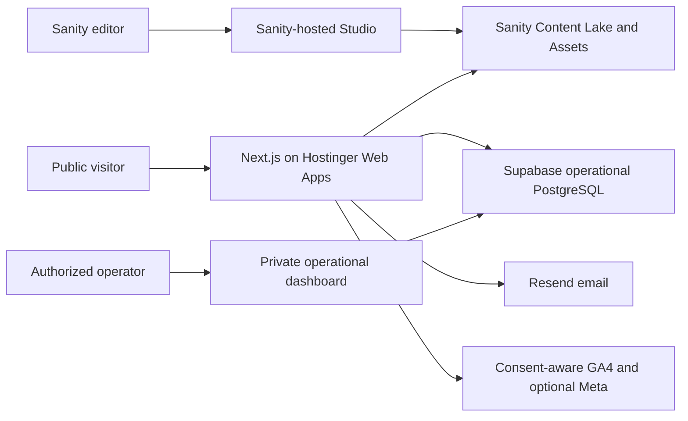

# Architecture

## Current target

The revised proposal supersedes the earlier custom-Supabase-CMS and Vercel hosting decisions. It does not remove the detailed website, blog, moderation, lead, SEO, accessibility, or analytics requirements.

## System ownership

### Sanity: editorial system of record

Sanity owns pages, page sections, product suites and modules, blogs and taxonomy, FAQs, consented testimonials, navigation, footer/site settings, galleries, images, and per-entry SEO. Sanity hosts Studio and applies its account/role system; the website's `/studio` route redirects editors to that configured URL. Keeping the large Studio bundle separate avoids coupling CMS deployment to Hostinger. Public queries return only approved or publishable records.

### Supabase: operational system of record

Supabase owns demo, digitization, and contact leads; comments and ratings keyed by Sanity blog slug; topic suggestions; moderation state; audit events; and aggregate operational analytics. RLS remains a required defense even when mutations use server routes. The existing `/admin` area is an operational console, not a second content CMS.

Legacy Supabase content and Storage tables remain in the current development database for rollback/reference. They are not the forward content system and must not receive new editorial features.

### Next.js: rendering and integration boundary

The App Router owns routes, metadata, server rendering, revalidation, public forms, validated route handlers, and the operational dashboard. Server Components are the default. Browser code is used only for interactive filters, lightboxes, consent-aware analytics, and form state.

### Resend: notification side effect

A lead is successful when Supabase persistence succeeds. Resend notification happens afterward, uses the saved record ID as its idempotency key, never exposes secrets to the browser, and does not turn a persisted lead into an HTTP failure.

### Hostinger: web runtime

Hostinger Web Apps runs the Next.js production server with Node.js 22, `npm run build`, and `npm run start`. `/api/health` provides a no-store liveness response. `APP_ENV=production` controls production robots behavior without relying on Vercel-specific variables.

## Rendering, caching, and publishing

- Indexable content must render meaningful HTML and complete metadata without client JavaScript.
- Sanity drafts/provisional records must not enter public pages, search, sitemap, JSON-LD, or cached responses.
- Public Sanity reads use bounded revalidation and content tags; future webhooks should invalidate affected tags/routes.
- Administrative, lead, and moderation responses are dynamic and never publicly cached.
- Canonical URLs and redirects need owner approval when published slugs change.
- Production has no source-code content fallback.

## Security and privacy

- Never expose Sanity write tokens, Supabase service-role keys, or Resend API keys.
- Validate all writes on the server and rate-limit public submissions.
- Anonymous visitors may create narrow submissions but may never list leads, drafts, private profiles, or moderation queues.
- Comment email addresses and form PII must never enter analytics payloads.
- Test both Sanity access roles and Supabase RLS; UI hiding is not authorization.

## Honest failure behavior

- If Sanity is not configured, `/studio` explains which public identifiers are missing. Development content may fall back to source fixtures; production renders honest unavailable/empty states.
- Missing Resend configuration returns a recorded `not_configured` notification status after the lead is saved.
- Missing analytics configuration disables that integration.
- Missing media never creates a fabricated screenshot or testimonial.

## Account-dependent work

Live Sanity project creation/import, editor invitations, production Hostinger deployment, Resend sender-domain verification, GA4/GSC properties, optional Meta tracking, DNS cutover, backup drills, and production operational acceptance require SBL-owned accounts and are not proven by a local build.
